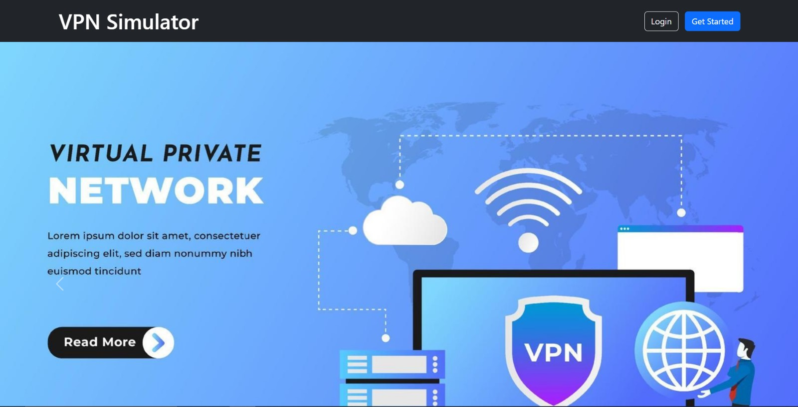
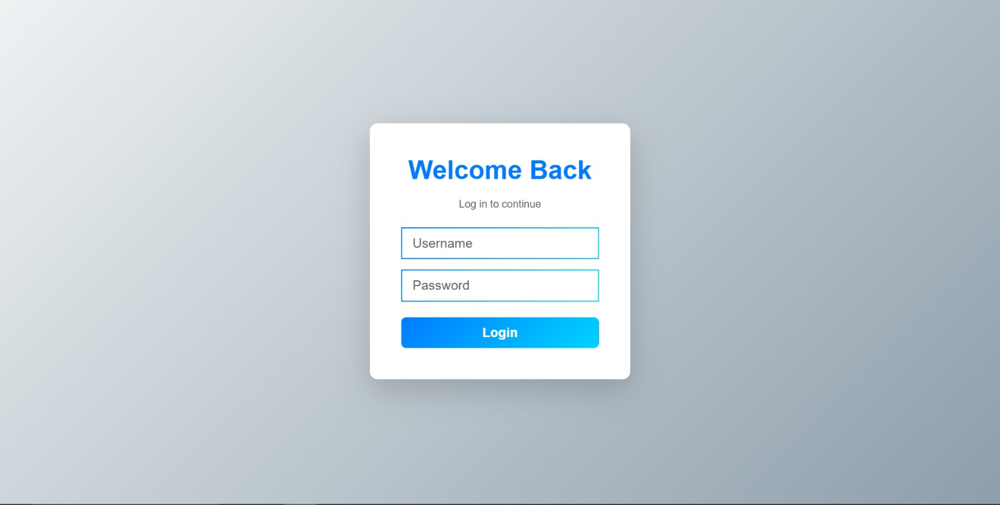
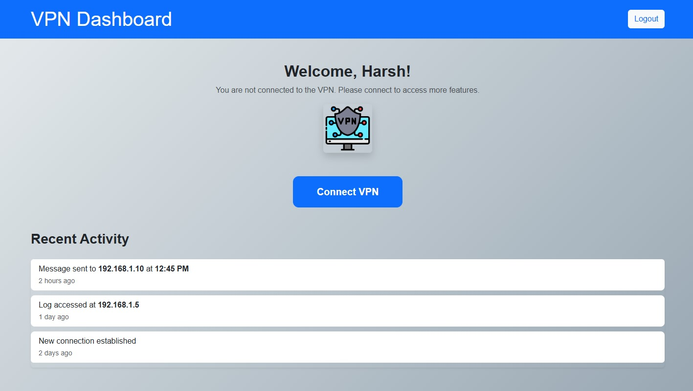
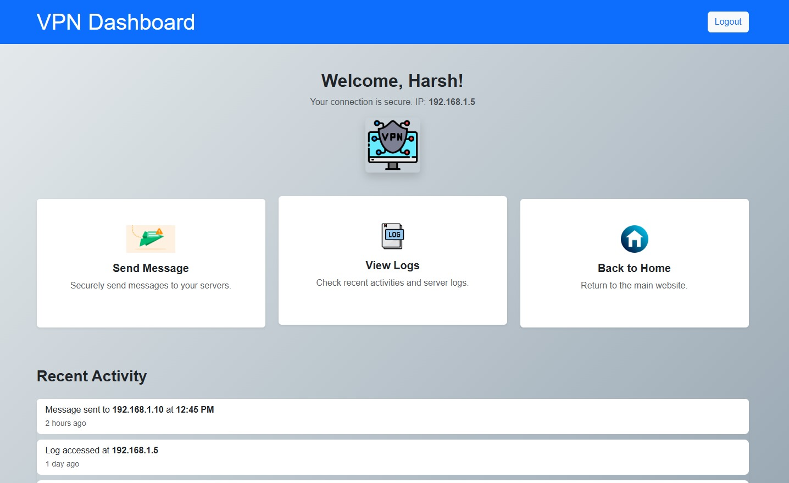
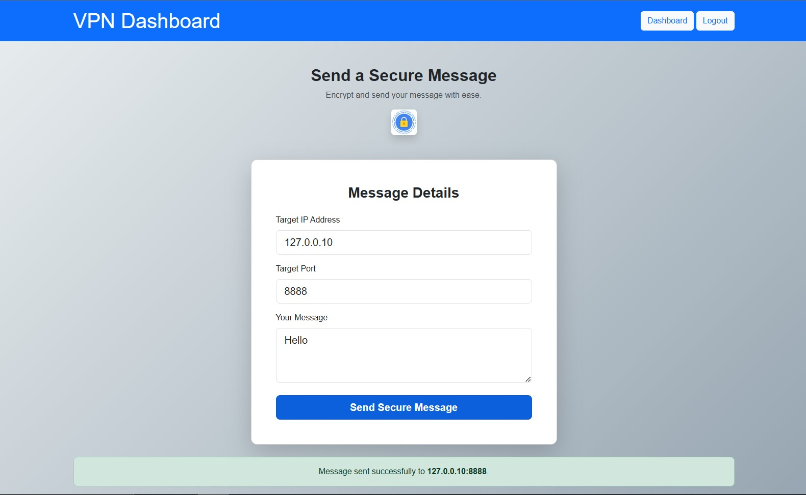
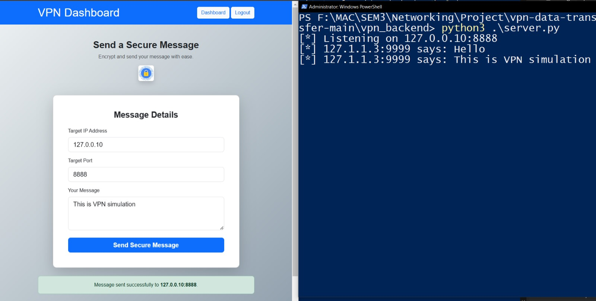

# VPN Simulation

## Table of Contents

- [Technical Details](#technical-details)
- [Project Structure](#project-structure)
- [Functionalities](#functionalities)
- [IP Ranges](#ip-ranges)
- [Frontend](#frontend)
- [Project Setup and Running](#project-setup-and-running)
- [Dashboard Screenshots](#dashboard-screenshots)

## Technical Details

The project is a comprehensive VPN simulation application built using:

- Backend: Python 3.10
- Frontend: Flask
- Protocol: User Datagram Protocol (UDP)

The main objective is to simulate and display data traffic on a VPN server, utilizing raw sockets from the Python `socket` library.

## Project Structure

### Backend Files

- `client.py`: Simple client implementation
- `server.py`: Simple server implementation
- `vpn.py`: Interactive VPN server
- `utils.py`: Utility functions
- `logs.txt`: VPN traffic logs storage

### JSON Configuration Files

- `users.json`: User credentials
- `ips.json`: IP address management
- `vlans.json`: VLAN configurations
- `restricted_users.json`: User access restrictions
- `restricted_vlans.json`: VLAN access restrictions

### Frontend Files

- `app.py`: Flask application
- `templates/`: HTML templates
- `static/`: CSS and JavaScript files

## Functionalities

### VPN Server Commands

- `start`: Start the VPN server and begin listening for client requests
- `stop`: Stop listening for client requests
- `create_user NAME PASSWORD ID_VLAN`: Create new VPN user credentials
- `restrict_user USERNAME IP_NETWORK`: Prevent user access to specific subnet
- `restrict_vlan ID_VLAN P_NETWORK`: Prevent VLAN access to specific subnet
- `list_users`: List VPN users
- `list_ips`: List virtual IPs assigned to users
- `list_vlans`: List VLAN IDs
- `list_users_restrictions`: List user restrictions
- `list_vlan_restrictions`: List VLAN restrictions

## IP Ranges

- VPN Server: `127.1.1.1`:`9999`
- Servers: `127.0.0.10` to `127.0.0.255`
- Current Implemented Server: `127.0.0.10`:`8888`
- VPN Clients Virtual IPs: `127.1.1.2` to `127.255.255.255`

## Frontend

The project includes a Flask-based web interface for managing and monitoring the VPN server. The frontend provides:

- User management
- VLAN configuration
- Traffic monitoring

## Project Setup and Running

### Prerequisites

- Python 3.10+
- pip (Python package manager)

### Installation Steps

1. Clone the repository

```bash
git clone https://github.com/harshsabhaya/vpn-simulation.git
cd vpn-simulation
```

2. Create a virtual environment

```bash
python3 -m venv venv
source venv/bin/activate  # On Windows, use `venv\Scripts\activate`
```

3. Install dependencies

```bash
pip install -r requirements.txt
```

### Running the Project

Follow these steps in order:

1. Start the VPN Server

```bash
python vpn.py
```

When prompted, use the `start` command to activate the VPN server.

2. Start the Main Server

```bash
python server.py
```

3. Run the Flask Frontend

```bash
flask run
```

4. Access the Web Interface
   Open a web browser and navigate to `http://127.0.0.1:5000/`

> **Note**: Raw socket operations may require administrator/root privileges.

## Dashboard Screenshots

### Homepage



### Login



### User Management Dashboard




### Send message




## License

Distributed under the MIT License. See `LICENSE` for more information.
